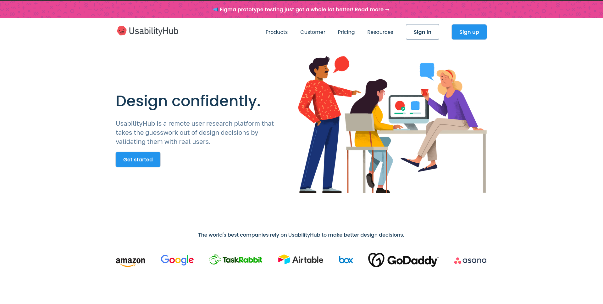

  <h1>Usability Hub Frontend Design Clone</h1>

  
This repository contains a clone of the frontend design of the Usability Hub website, implemented using HTML and CSS.

  <h2>Features</h2>

  <ul>
    <li>Faithful reproduction of the original Usability Hub website's frontend design.</li>
    <li>Responsive layout ensuring compatibility with various devices and screen sizes.</li>
    <li>Clean and modern user interface, mirroring the design principles of Usability Hub.</li>
  </ul>

  <h2>Screenshots</h2>

  
Screenshots of the cloned frontend design here:

  
  
  
  
  

  <h2>Usage</h2>

  
Clone the repository to your local machine:

  <pre><code>git clone https://github.com/Dark-Programer/usability-hub-replica.git</code></pre>

  
Open the <code>index.html</code> file in your web browser to view the cloned Usability Hub frontend design.

  <h2>Author</h2>

  
Arka Chakraborty

